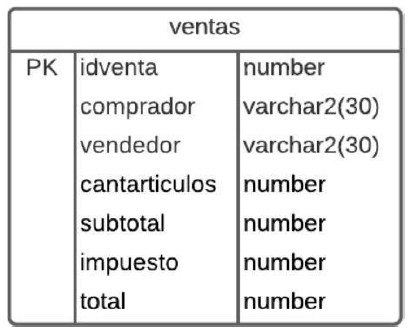
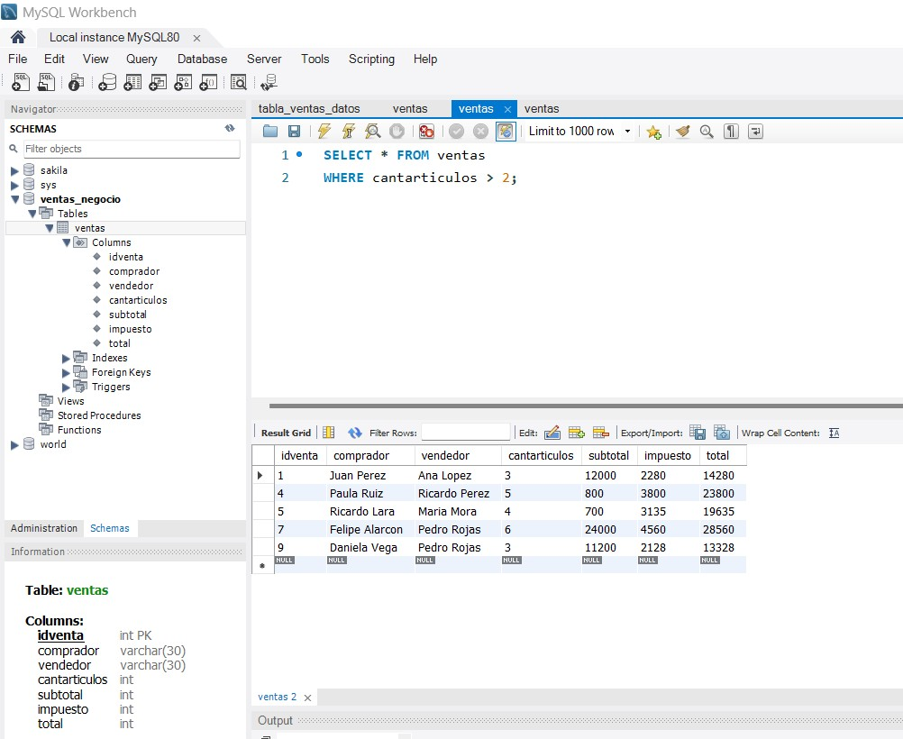
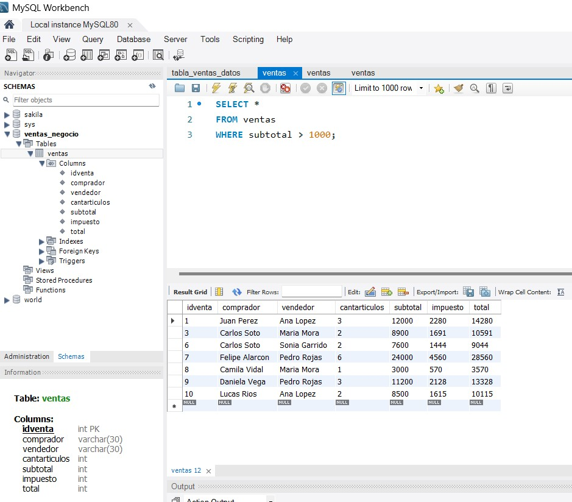
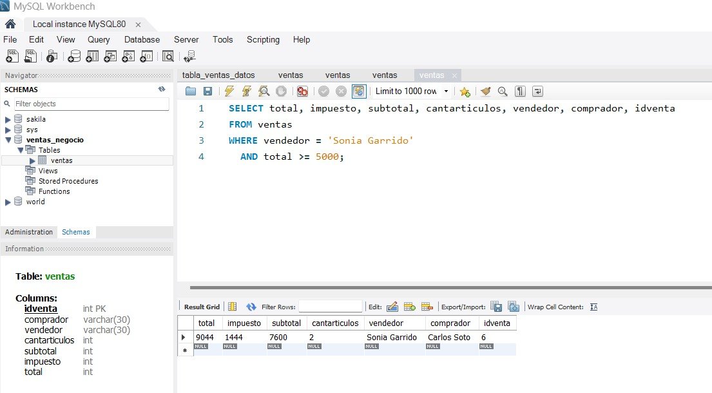
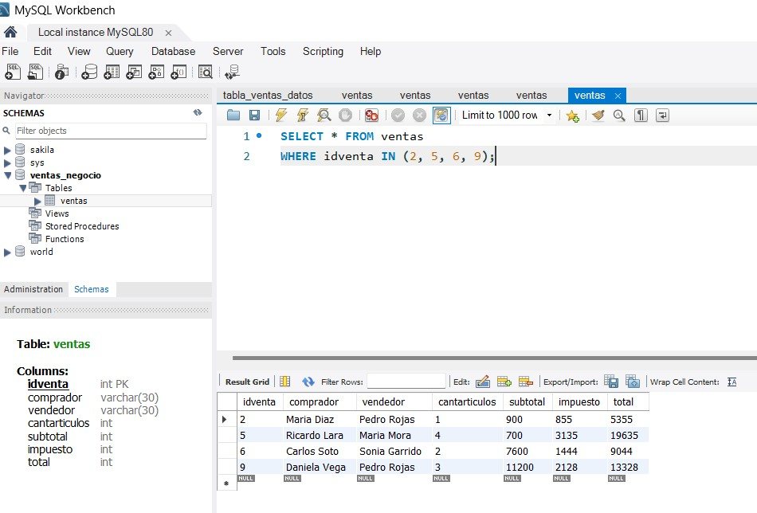

**_<h1 align="center">:vulcan_salute: Proyecto Tabla de Ventas MySQL :computer:</h1>_**

**<h3>:blue_book: Contexto:</h3>**

- La tabla que almacena las ventas en un negocio posee los siguientes campos:



- La primera columna indica si el campo es parte de una llave primaria, el segundo el nombre del campo, y el tercero el tipo de dato (number es un tipo numérico, mientras que varchar2 es un tipo texto y va acompañado del largo máximo del campo).

**<h3>:orange_book: Requerimientos:</h3>**

- En un archivo de texto, indique las siguientes consultas:
1. Una consulta que permita obtener todos los registros de la tabla tales que la cantidad de artículos sea mayor que 2, devolviendo todos sus campos.
2. Una consulta que permita obtener todos los registros de la tabla tales que el subtotal sea menor que 1000, desplegando solo el ID de venta, el comprador y la cantidad de artículos.
3. Una consulta que permite obtener los registros tales que el vendedor tiene el nombre “SONIA GARRIDO”, y que el valor total de la venta es mayor o igual a 5000. Debe indicar todos los campos de la tabla, pero en orden inverso al que se indica en la figura.
4. Una consulta que retorne los registros de la tabla tales que el comprador es “LUCAS”, o bien que el vendedor es “MARIA”. Despliegue solo los campos vendedor, comprador y total, en ese orden.
5. Una consulta que despliegue todos los campos de todos los registros tales que el identificador está en el siguiente conjunto: 2,5,6 y 9.

**<h3>:green_book: Texto para creación y consultas:</h3>**

1. Código para crear la tabla `ventas`:

```sql 
CREATE TABLE ventas (
    idventa INT NOT NULL PRIMARY KEY,
    comprador VARCHAR(30) NOT NULL,
    vendedor VARCHAR(30) NOT NULL,
    cantarticulos INT NOT NULL,
    subtotal INT NOT NULL,
    impuesto INT NOT NULL,
    total INT NOT NULL
);
```


2. Consulta registros con cantidad de artículos mayor que 2:

```sql
    SELECT * FROM ventas
    WHERE cantarticulos > 2;
```



3. Consulta registros subtotal menor a 1000:

```sql
    SELECT idventa, comprador, cantarticulos 
    FROM ventas 
    WHERE subtotal < 1000;
```



4. Consulta registros vendedor "SONIA GARRIDO" y total mayor o igual a 5000:

```sql
    SELECT * FROM ventas 
    WHERE vendedor = 'Sonia Garrido' AND total >= 5000 
    ORDER BY idventa DESC;
```



5. Consulta registros comprador "LUCAS" o vendedor "MARIA":

```sql
    SELECT vendedor, comprador, total 
    FROM ventas 
    WHERE comprador = 'Lucas Rios'
       OR vendedor = 'Maria Mora';
```


6. Consulta registros con idventa 2, 5, 6 y 9:

```sql
    SELECT * FROM ventas 
    WHERE idventa IN (2, 5, 6, 9);
```
``


**<h3>📁 Estructura del Proyecto:</h3>**

```
📁 ./   
├── README.md  
└── 📁img/  
    ├── registros_idventas_2569.jpg  
    ├── select_cantarticulos_mayor_dos.jpg  
    ├── select_ventas_menor_mil.jpg
    ├── tabla_contexto.jpg
    ├── vendedor_maria_comprador_lucas.jpg
    └── vendedor_inverso_cinco_mil.jpg  
└── 📁mysql/  
    ├── create_table_ventas.sql 
    ├── registros_idventas_2569.sql  
    ├── select_cantarticulos_mayor_dos.sql
    ├── select_ventas_menor_mil.sql
    ├── tabla_ventas_datos.sql
    ├── vendedor_maria_comprador_lucas.sql
    └── vendedor_inverso_cinco_mil.sql
```


**<h3>:book: Ejemplo de Salida:</h3>**

